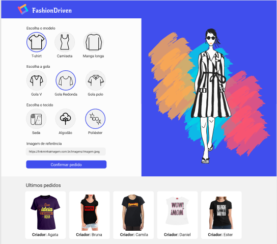

<h1 align="center">Projeto FashionDriven </h1>

Esse desafio, foi desenvolver a aplicação do FashionDriven a partir de um layout, colocando em prática tudo o que aprendi.

✅ Requisitos

- Geral
    - [x]  Não utilize nenhuma biblioteca para implementar este projeto (jQuery, lodash, React, etc), nem outras linguagens que compilem para JS (TypeScript, ELM, etc), somente JavaScript puro.
    - [x]  Seu projeto deverá ser desenvolvido utilizando Git e GitHub, em um repositório público.
    - [x]  A cada requisito implementado faça um commit com uma mensagem descritiva do que você evoluiu.
- *Layout*
    - [x]  Aplicar *layout* para *desktop* seguindo o Figma fornecido.
- Montar blusa
    - [x]  Ao entrar no sistema, deve ser perguntado o nome da pessoa através de um `prompt()`.
    - [x]  O usuário deve selecionar obrigatoriamente e somente um tipo de modelo, gola e tecido, que devem ficar destacados conforme *layout*.
    - [x]  O usuário deve preencher obrigatoriamente um campo de texto para colocar um link para uma imagem de referencia.
- Encomendar blusa
    - [x]  Somente após preencher todas as informações anteriores o botão "confirmar" deve ficar clicável.
    - [x]  Após clicar no botão, deve ser exibido um `alert()` confirmando a encomenda.
        - [x]  Caso a requisição retorne sucesso, a encomenda é confirmada.
        - [x]  Caso a requisição retorne um erro, a página deve mostrar a mensagem `Ops, não conseguimos processar sua encomenda`.
- Mostrar blusas encomendadas recentemente
    - [x]  Assim que a página for aberta, devem ser exibidas as últimas 10 blusas, mostrando o criador da blusa conforme o *layout*.
    - [x]  Assim que uma blusa for criada pelo usuário, a lista de últimos pedidos deve ser atualizada.
- Encomendar blusa criada por alguém
    - [x]  Ao clicar em uma blusa na lista "últimos pedidos" deve aparecer um `confirm()` e caso o usuário aceite, a página deve fazer uma encomenda com os dados da blusa clicada.

## 🛠 &nbsp;Skills

  
  
  
          
  
                                     

## 🚀 &nbsp;Links

- [Figma](https://www.figma.com/file/8mFZTdJTsPLSmwcfWydmR4/Projeto-Fashion-Driven?node-id=0%3A1&t=Aee3gR5ZJfoT53Zs-0). 
- [Deploy](https://projeto-fashiondriven.vercel.app/). 
___

## 💬 &nbsp;Contact

Feito por [Raissa Curty](https://github.com/curtyraissa)!

&nbsp;
